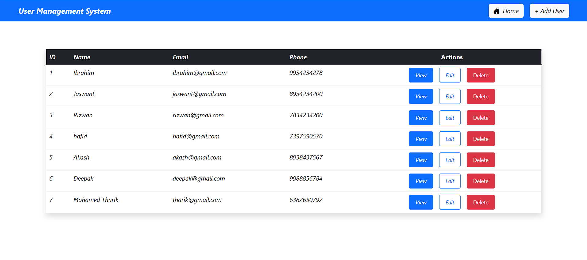
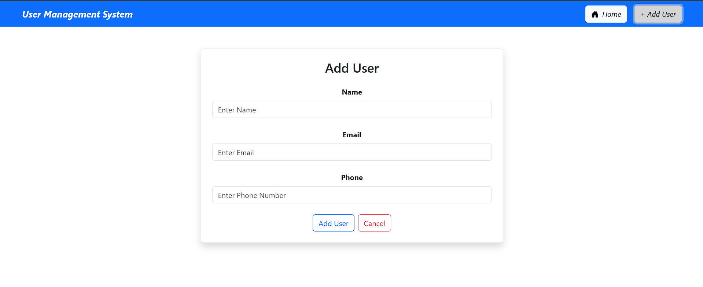
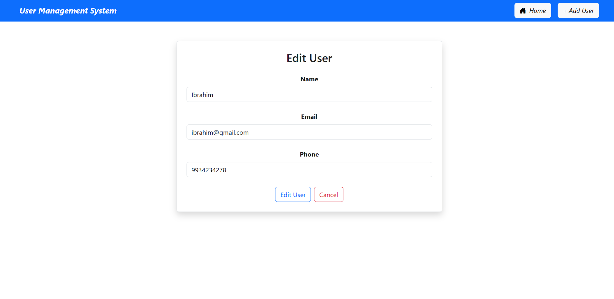
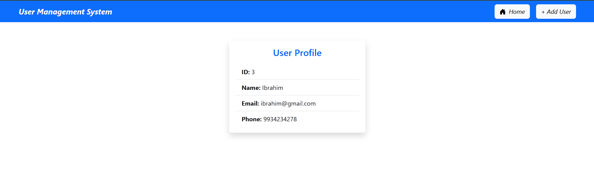

# User Management System

A full-stack User Management CRUD application built using React.js and Spring Boot.

## Features

- Add User
- View Users
- Edit User
- Delete User
- REST API Integration
- Responsive UI
- MySQL Database

## Screenshots

### Home Page

### Add User

### Edit User

### View User By ID

## Tech Stack

### Frontend

- React.js
- Axios
- Bootstrap
- React Router DOM

### Backend

- Spring Boot
- Spring Data JPA
- Hibernate
- MySQL

## Project Structure

User-Management-System
├── frontend
└── backend

## API Endpoints

| Method | Endpoint   |
| ------ | ---------- |
| GET    | /users     |
| GET    | /user/{id} |
| POST   | /user      |
| PUT    | /user/{id} |
| DELETE | /user/{id} |

## Installation

### Frontend

npm install

npm run dev

### Backend

Run Spring Boot Application

## Author

Your Name
